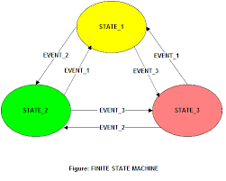
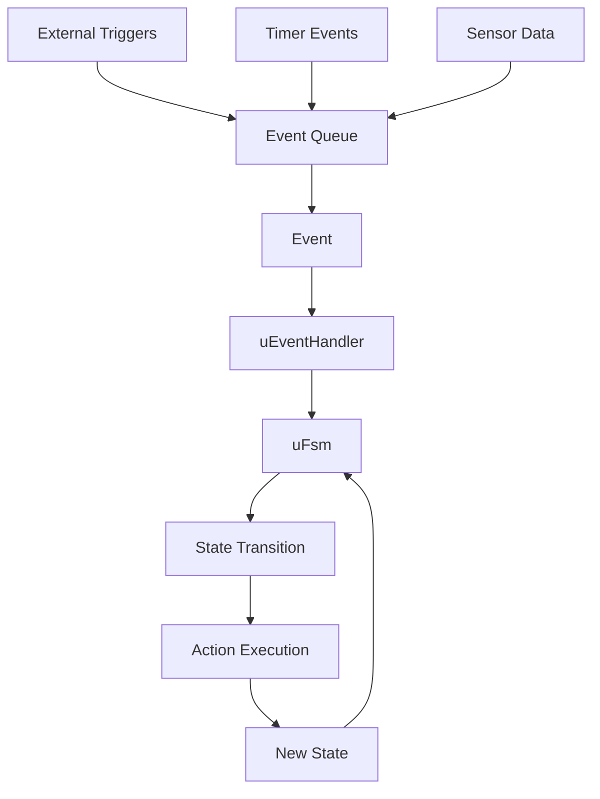

<div align="center">
  
  
  # IoT-uFSM
  
  **Ultra-lightweight, event-driven C++11 finite state machine library for IoT, embedded, and automation projects**
  
  [](https://github.com/hemonserrat/IoT-uFSM/actions/workflows/ci.yml)
  [](https://sonarcloud.io/dashboard?id=hemonserrat_IoT-uFSM)
  [](https://www.gnu.org/licenses/gpl-3.0)
  [](https://en.wikipedia.org/wiki/C%2B%2B11)
  [](https://github.com/hemonserrat/IoT-uFSM)
  
  [📚 Documentation](https://hemonserrat.github.io/IoT-uFSM/index.html) • [🐛 Report Bug](https://github.com/hemonserrat/IoT-uFSM/issues) • [✨ Request Feature](https://github.com/hemonserrat/IoT-uFSM/issues)
</div>

---

## 📋 Table of Contents

- [🚀 Features](#-features)
- [⚡ Quick Start](#-quick-start)
- [📦 Installation](#-installation)
- [💡 Usage Examples](#-usage-examples)
- [🏗️ Architecture](#️-architecture)
- [📖 Documentation](#-documentation)
- [🧪 Testing](#-testing)
- [🤝 Contributing](#-contributing)
- [📄 License](#-license)
- [🔗 Links](#-links)

---

## 🚀 Features

IoT-uFSM is a **micro finite state machine library** designed specifically for **IoT devices**, **embedded systems**, and **automation projects**. Built with modern C++11 standards, it provides a robust foundation for state-driven applications.

### ✨ Key Benefits

- ⚡ **Ultra-lightweight**: Minimal memory footprint, perfect for microcontrollers and resource-constrained devices
- 🔌 **C++11 Standard**: Modern, portable, and easy to integrate with existing C++ projects
- 🔄 **Event-Driven Architecture**: Clean separation between state logic and event handling
- 🌍 **Cross-Platform**: Works seamlessly on macOS, Linux, Windows, and embedded targets
- 📦 **Zero Dependencies**: No external libraries required beyond standard C++11
- 🎯 **IoT-Ready**: Optimized for Internet of Things and embedded applications
- 🧪 **Well-Tested**: Comprehensive test suite using Catch2 framework
- 📚 **Comprehensive Documentation**: Full API documentation with Doxygen
- 🔧 **Easy Integration**: Simple CMake build system with automatic dependency management

### 🎯 Perfect For

- **IoT Devices**: Smart sensors, actuators, and connected devices
- **Embedded Systems**: Microcontroller-based projects and real-time applications
- **Automation**: Industrial control systems and home automation
- **Robotics**: State-based robot behavior and control systems
- **Protocol Implementations**: Communication protocol state machines

---

## ⚡ Quick Start

Get up and running with IoT-uFSM in minutes:

```cpp
#include "uFsm.hpp"
#include "uEventHandler.hpp"

// Define your states
#define IDLE_STATE     0x0001
#define ACTIVE_STATE   0x0002
#define ERROR_STATE    0xFFFF

// Define your events
#define START_EVENT    0x0001
#define STOP_EVENT     0x0002
#define ERROR_EVENT    0x0003

// Create your event handler
class MyEventHandler : public uEventHandler {
public:
    MyEventHandler() : uEventHandler(3) {
        FillHandlersArray();
    }

private:
    void FillHandlersArray() override {
        functions_[0] = (TransitionFunc)&MyEventHandler::handleStart;
        functions_[1] = (TransitionFunc)&MyEventHandler::handleStop;
        functions_[2] = (TransitionFunc)&MyEventHandler::handleError;
    }
    
    bool handleStart(void* params) {
        std::cout << "Starting device..." << std::endl;
        return true;
    }
    
    bool handleStop(void* params) {
        std::cout << "Stopping device..." << std::endl;
        return true;
    }
    
    bool handleError(void* params) {
        std::cout << "Error occurred!" << std::endl;
        return false;
    }
};

int main() {
    // Create event handler and FSM
    MyEventHandler handler;
    uFsm fsm(&handler, 10, IDLE_STATE);
    
    // Define state transitions
    fsm.defineTransition(IDLE_STATE, ACTIVE_STATE, START_EVENT, 0);
    fsm.defineTransition(ACTIVE_STATE, IDLE_STATE, STOP_EVENT, 1);
    fsm.defineTransition(IDLE_STATE, ERROR_STATE, ERROR_EVENT, 2);
    
    // Process events
    fsm.control(START_EVENT);  // IDLE -> ACTIVE
    fsm.control(STOP_EVENT);   // ACTIVE -> IDLE
    
    return 0;
}
```

---

## 📦 Installation

### Prerequisites

- **C++11 compatible compiler** (GCC 4.8+, Clang 3.3+, MSVC 2015+)
- **CMake 3.10 or higher**

### Build from Source

#### macOS
```bash
# Install CMake (if not already installed)
brew install cmake

# Clone the repository
git clone https://github.com/hemonserrat/IoT-uFSM.git
cd IoT-uFSM

# Create build directory
mkdir -p build

# Configure the project
cmake -S . -B build

# Build the project
cmake --build build

# Run tests (optional)
ctest --test-dir build
```

#### Linux (Ubuntu/Debian)
```bash
# Install dependencies
sudo apt-get update
sudo apt-get install build-essential cmake git

# Clone and build
git clone https://github.com/hemonserrat/IoT-uFSM.git
cd IoT-uFSM
mkdir -p build
cmake -S . -B build
cmake --build build

# Run tests
ctest --test-dir build
```

#### Windows (Visual Studio)
```cmd
# Clone the repository
git clone https://github.com/hemonserrat/IoT-uFSM.git
cd IoT-uFSM

# Create build directory
mkdir build

# Configure with Visual Studio
cmake -S . -B build -G "Visual Studio 16 2019"

# Build the project
cmake --build build --config Release

# Run tests
ctest --test-dir build --config Release
```

### Integration with Your Project

#### Using CMake FetchContent
```cmake
include(FetchContent)
FetchContent_Declare(
  IoT-uFSM
  GIT_REPOSITORY https://github.com/hemonserrat/IoT-uFSM.git
  GIT_TAG        master
)
FetchContent_MakeAvailable(IoT-uFSM)

target_link_libraries(your_target PRIVATE IoT-uFSM)
```

#### Manual Integration
Simply copy the `inc/` and `src/` directories to your project and include them in your build system.

---

## 💡 Usage Examples

### IoT Sensor State Machine

```cpp
// IoT temperature sensor with different operating modes
class TemperatureSensor : public uEventHandler {
    enum States { SLEEP = 1, MEASURING = 2, TRANSMITTING = 3, ERROR = 0xFF };
    enum Events { WAKE_UP = 1, MEASURE_COMPLETE = 2, TRANSMIT_COMPLETE = 3, SENSOR_ERROR = 4 };

public:
    TemperatureSensor() : uEventHandler(4) {
        fsm_ = new uFsm(this, 10, SLEEP);
        setupTransitions();
        FillHandlersArray();
    }

private:
    void setupTransitions() {
        fsm_->defineTransition(SLEEP, MEASURING, WAKE_UP, 0);
        fsm_->defineTransition(MEASURING, TRANSMITTING, MEASURE_COMPLETE, 1);
        fsm_->defineTransition(TRANSMITTING, SLEEP, TRANSMIT_COMPLETE, 2);
        fsm_->defineTransition(MEASURING, ERROR, SENSOR_ERROR, 3);
    }
    
    void FillHandlersArray() override {
        functions_[0] = (TransitionFunc)&TemperatureSensor::startMeasurement;
        functions_[1] = (TransitionFunc)&TemperatureSensor::startTransmission;
        functions_[2] = (TransitionFunc)&TemperatureSensor::enterSleepMode;
        functions_[3] = (TransitionFunc)&TemperatureSensor::handleSensorError;
    }
    
    bool startMeasurement(void* params) {
        // Initialize sensor and start measurement
        return true;
    }
    
    bool startTransmission(void* params) {
        // Send data to IoT platform
        return true;
    }
    
    bool enterSleepMode(void* params) {
        // Enter low-power mode
        return true;
    }
    
    bool handleSensorError(void* params) {
        // Handle sensor malfunction
        return false;
    }
    
    uFsm* fsm_;
};
```

### Home Automation Controller

```cpp
// Smart home device controller
class SmartDevice : public uEventHandler {
    enum States { OFF = 1, STANDBY = 2, ACTIVE = 3, MAINTENANCE = 4 };
    enum Events { POWER_ON = 1, ACTIVATE = 2, DEACTIVATE = 3, MAINTENANCE_MODE = 4 };

    // Implementation details...
};
```

---

## 🏗️ Architecture

IoT-uFSM follows a clean, event-driven architecture designed for embedded systems:



### Core Components

- **`uFsm`**: The main finite state machine class that manages states and transitions
- **`uEventHandler`**: Abstract base class for implementing event handling logic
- **`uFsmEvent`**: Event class that encapsulates event data and parameters
- **Transition Table**: Efficient hash-based lookup for state transitions

### Key Design Principles

- **Memory Efficient**: Static allocation with configurable limits
- **Real-time Safe**: Deterministic execution time for embedded systems
- **Event-Driven**: Asynchronous event processing with internal queue
- **Extensible**: Easy to extend with custom event handlers and states

---

## 📖 Documentation

- **[API Documentation](https://hemonserrat.github.io/IoT-uFSM/index.html)**: Complete Doxygen-generated API reference
- **[Getting Started Guide](https://hemonserrat.github.io/IoT-uFSM/index.html)**: Step-by-step tutorial for beginners
- **[Examples](CFsmTest.cpp)**: Real-world usage examples and test cases

### Key Classes

- [`uFsm`](https://hemonserrat.github.io/IoT-uFSM/classu_fsm.html): Main FSM implementation
- [`uEventHandler`](https://hemonserrat.github.io/IoT-uFSM/classu_event_handler.html): Event handler base class
- [`uFsmEvent`](https://hemonserrat.github.io/IoT-uFSM/classu_fsm_event.html): Event data container

---

## 🧪 Testing

IoT-uFSM includes a comprehensive test suite using the Catch2 framework:

```bash
# Run all tests
ctest --test-dir build

# Run with verbose output
ctest --test-dir build --verbose

# Run specific test
./build/test_fsm
```

### Test Coverage

- ✅ State transition validation
- ✅ Event handling and parameter passing
- ✅ Error condition handling
- ✅ Memory management and cleanup
- ✅ Edge cases and boundary conditions

---

## 🤝 Contributing

We welcome contributions from the community! Here's how you can help:

### Ways to Contribute

- 🐛 **Report Bugs**: [Create an issue](https://github.com/hemonserrat/IoT-uFSM/issues) with detailed reproduction steps
- ✨ **Request Features**: [Suggest new features](https://github.com/hemonserrat/IoT-uFSM/issues) for IoT and embedded use cases
- 📝 **Improve Documentation**: Help us make the docs clearer and more comprehensive
- 🔧 **Submit Code**: Fork the repo and submit pull requests

### Development Setup

1. Fork the repository
2. Create a feature branch: `git checkout -b feature/amazing-feature`
3. Make your changes and add tests
4. Ensure all tests pass: `ctest --test-dir build`
5. Commit your changes: `git commit -m 'Add amazing feature'`
6. Push to the branch: `git push origin feature/amazing-feature`
7. Open a Pull Request

### Code Style

- Follow existing C++11 coding conventions
- Include Doxygen documentation for public APIs
- Add unit tests for new functionality
- Ensure cross-platform compatibility

---

## 📄 License

This project is licensed under the **GNU General Public License v3.0** - see the [LICENSE](LICENSE) file for details.

### What this means:
- ✅ **Free to use** in open source projects
- ✅ **Modify and distribute** under the same license
- ✅ **Commercial use** allowed with GPL compliance
- ❌ **Cannot be used** in proprietary software without GPL compliance

For commercial licensing options, please [contact the maintainer](https://github.com/hemonserrat/IoT-uFSM/discussions).

---

## 🔗 Links

### Project Resources
- **[GitHub Repository](https://github.com/hemonserrat/IoT-uFSM)**: Source code and issue tracking
- **[Documentation](https://hemonserrat.github.io/IoT-uFSM/index.html)**: Complete API reference
- **[Releases](https://github.com/hemonserrat/IoT-uFSM/releases)**: Download stable versions
- **[Issues](https://github.com/hemonserrat/IoT-uFSM/issues)**: Bug reports and feature requests

### Community
- **[Discussions](https://github.com/hemonserrat/IoT-uFSM/discussions)**: Community Q&A and ideas
- **[Wiki](https://github.com/hemonserrat/IoT-uFSM/wiki)**: Additional documentation and tutorials

### Related Projects
- **[Catch2](https://github.com/catchorg/Catch2)**: Testing framework used by IoT-uFSM
- **[CMake](https://cmake.org/)**: Build system

---

<div align="center">
  
  **Made with ❤️ for the IoT and embedded systems community**
  
  ⭐ **Star this repo** if you find it useful! ⭐
  
</div>
